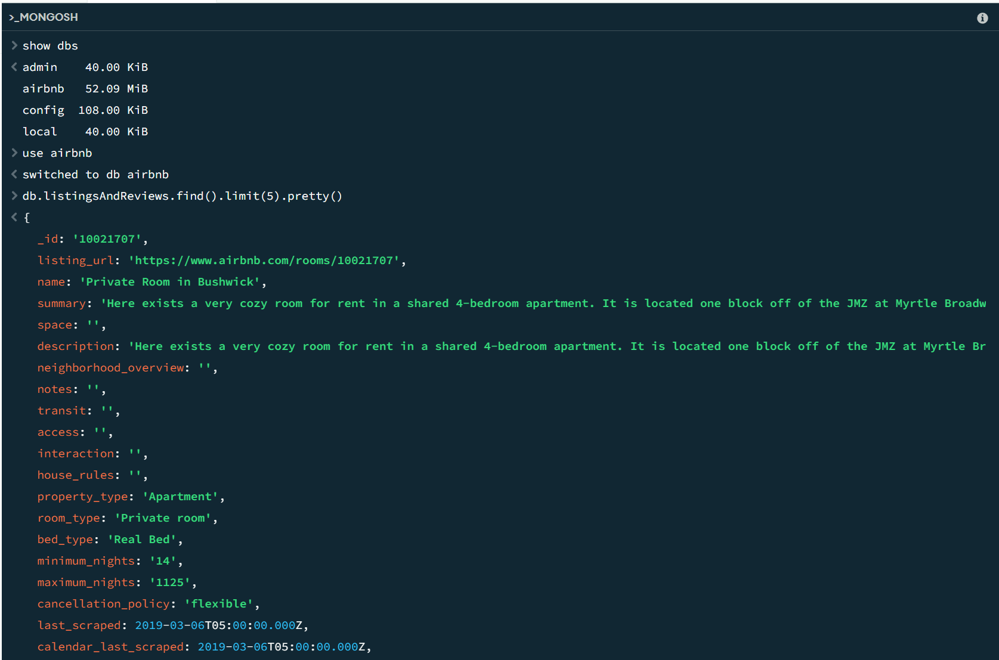
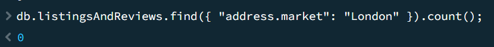
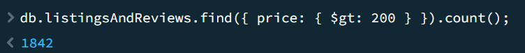
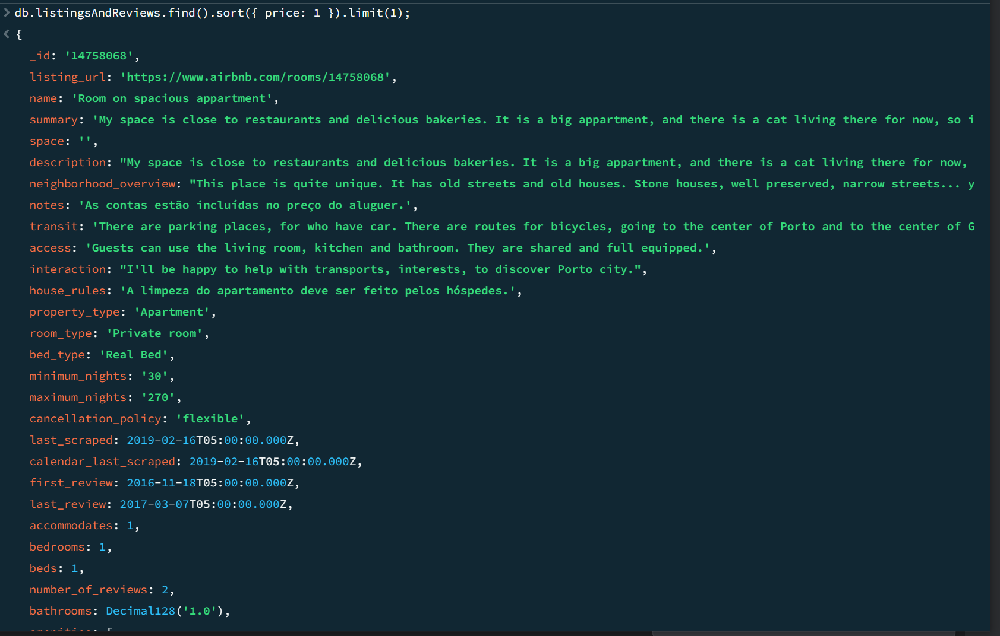
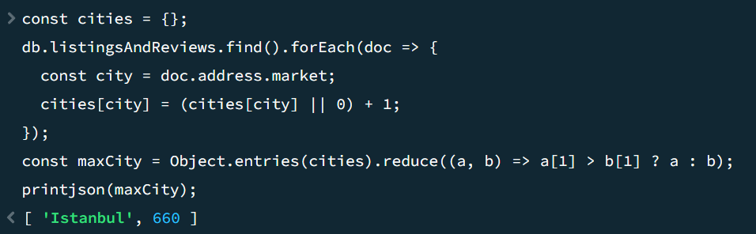
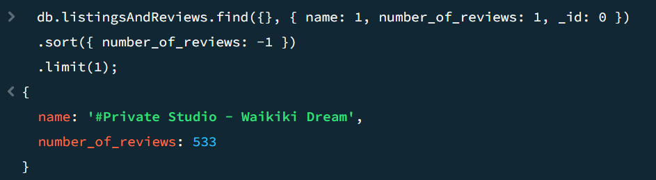

# Документо-ориентированные базы данных

### Задание 
1. Загрузите в MongoDB данные о листингах и отзывах AirBnB.
2. Составьте запросы и найдите ответы на следующие вопросы:
* Найти количество объектов, находящихся в Лондоне.
* Найти количество объектов с ценой выше $200.
* Найти объект с минимальной ценой.
* Найти город с максимальным количеством объектов.
* Найти объект с наибольшим количеством отзывов и вывести его название и количество отзывов.

### Результат
1. Загрузка данных
```bash
mongoimport --db airbnb --collection listingsAndReviews --file "db_hometask\dz_2\resources\listingsAndReviews.json"
```
Проверка:


2. Запросы и их результаты:

* Найти количество объектов, находящихся в Лондоне.
```
db.listingsAndReviews.find({ "address.market": "London" }).count();

```


* Найти количество объектов с ценой выше $200.
```
db.listingsAndReviews.find({ price: { $gt: 200 } }).count();
```


* Найти объект с минимальной ценой.
```
db.listingsAndReviews.find().sort({ price: 1 }).limit(1);
```


* Найти город с максимальным количеством объектов.
```
const cities = {};
db.listingsAndReviews.find().forEach(doc => {
  const city = doc.address.market;
  cities[city] = (cities[city] || 0) + 1;
});
const maxCity = Object.entries(cities).reduce((a, b) => a[1] > b[1] ? a : b);
printjson(maxCity);
```


* Найти объект с наибольшим количеством отзывов и вывести его название и количество отзывов.
```
db.listingsAndReviews.find({}, { name: 1, number_of_reviews: 1, _id: 0 })
.sort({ number_of_reviews: -1 })
.limit(1);
```
