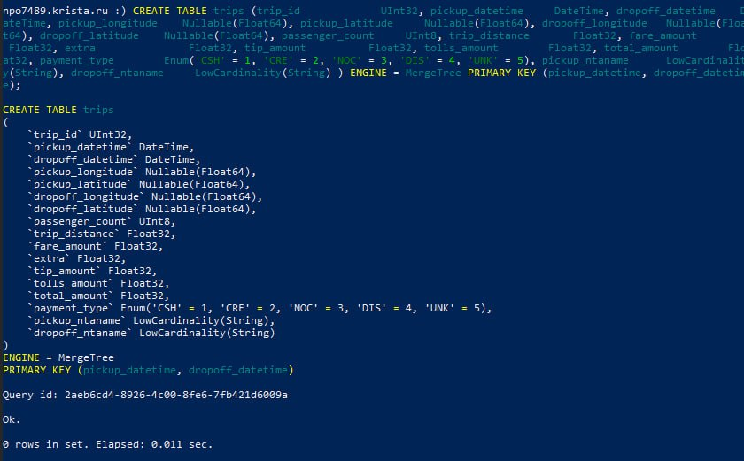
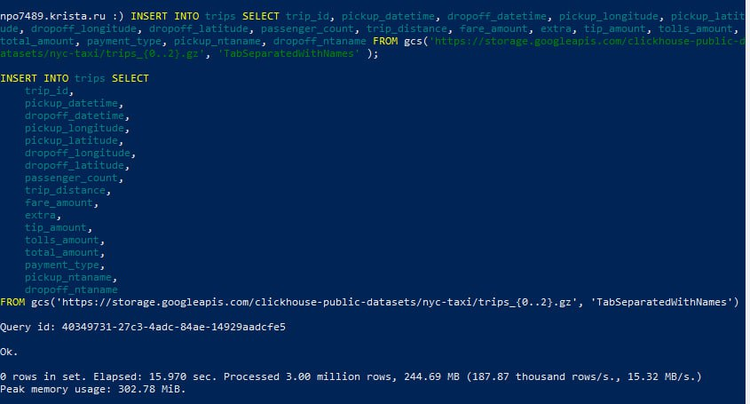
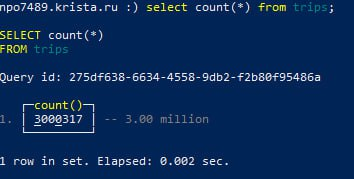
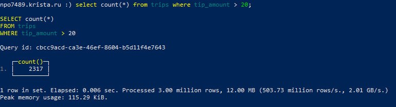
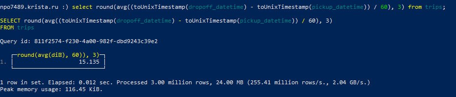
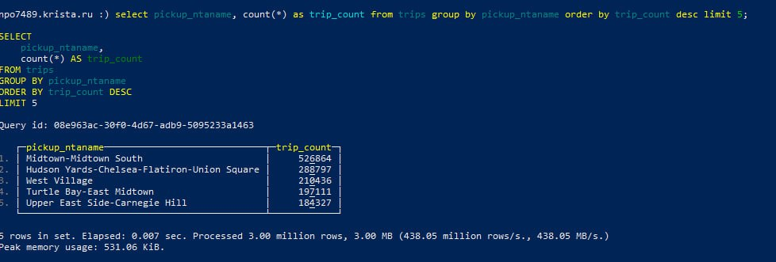
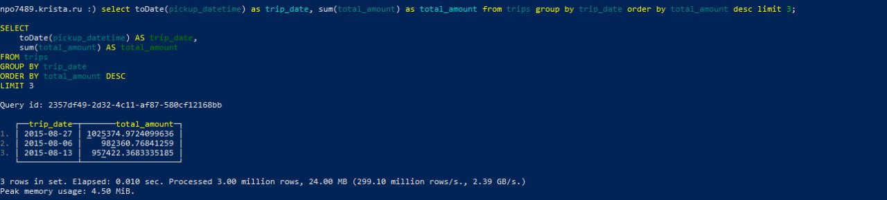

# Документо-ориентированные базы данных

### Задание 
1. Загрузите в ClickHouse [данные](https://clickhouse.com/docs/getting-started/example-datasets/nyc-taxi) о поездках на такси в Нью-Йорке.
2. Составьте запросы и найдите ответы на следующие вопросы:
   * Посчитать общее количество записей в таблице (сколько всего поездок)
   * Найти, сколько поездок сопровождались «крупными» чаевыми (больше $20)
   * Определить среднюю продолжительность поездки в минутах
   * Найти 5 самых популярных зон для начала поездки и вывести их названия вместе с количеством поездок
   * Найти топ-3 дня, в которые была наибольшая суммарная выручка

### Результат
1. Загрузка данных





2. Запросы и их результаты:

* Посчитать общее количество записей в таблице (сколько всего поездок)
```
select count(*) from trips;

```


* Найти, сколько поездок сопровождались «крупными» чаевыми (больше $20)
```
select count(*) from trips where tip_amount > 20;
```


* Определить среднюю продолжительность поездки в минутах
```
select round(avg((toUnixTimestamp(dropoff_datetime) - toUnixTimestamp(pickup_datetime)) / 60), 3) from trips;
```


* Найти 5 самых популярных зон для начала поездки и вывести их названия вместе с количеством поездок
```
select pickup_ntaname, count(*) as trip_count from trips group by pickup_ntaname order by trip_count desc limit 5;
```


* Найти топ-3 дня, в которые была наибольшая суммарная выручка
```
select toDate(pickup_datetime) as trip_date, sum(total_amount) as total_amount from trips group by trip_date order by total_amount desc limit 3;
```
